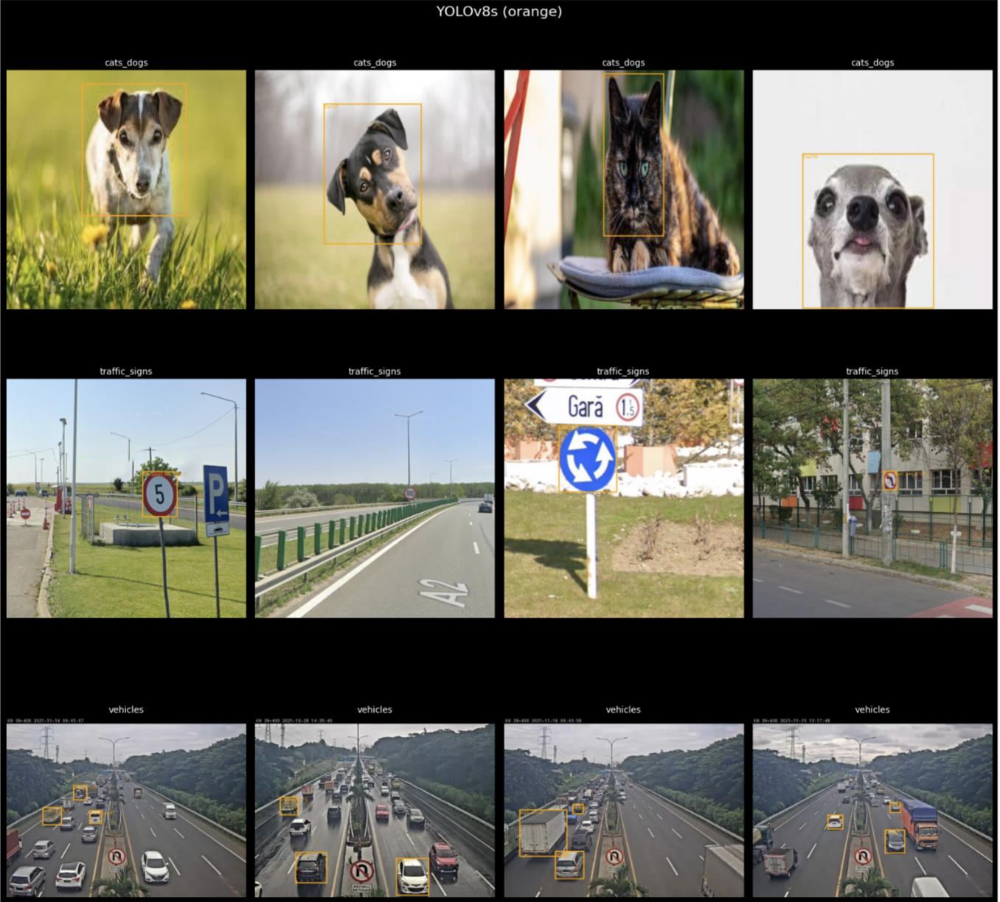
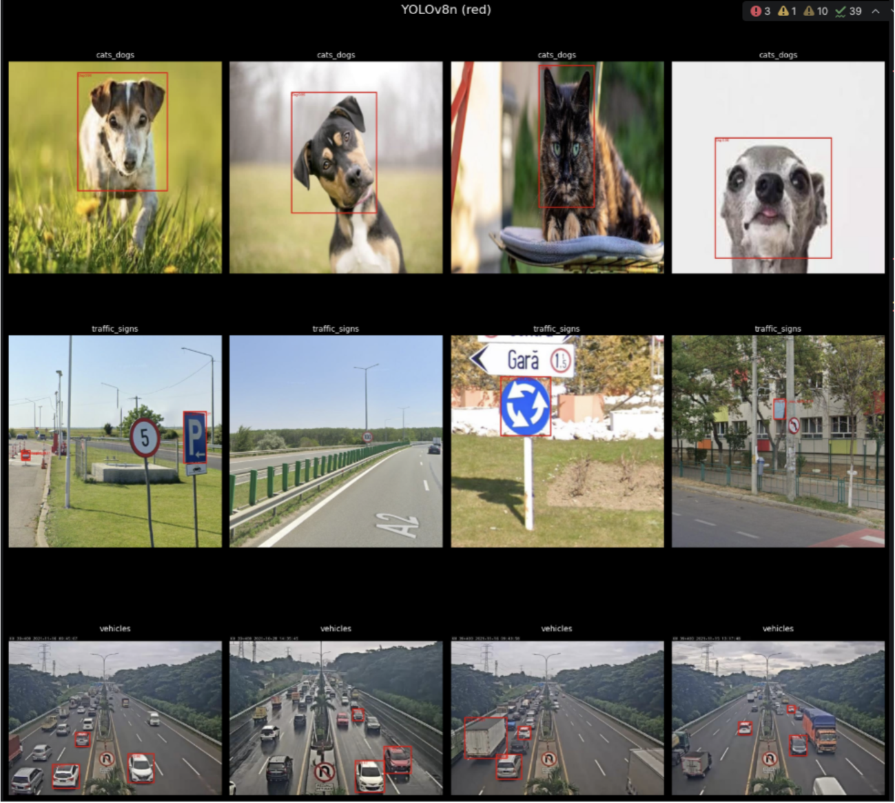
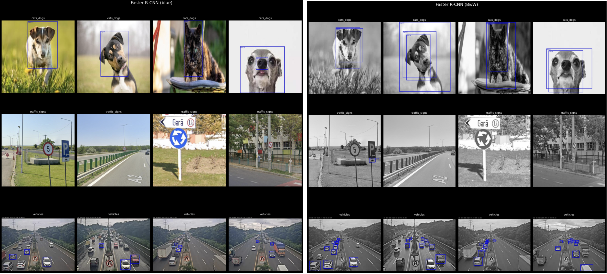
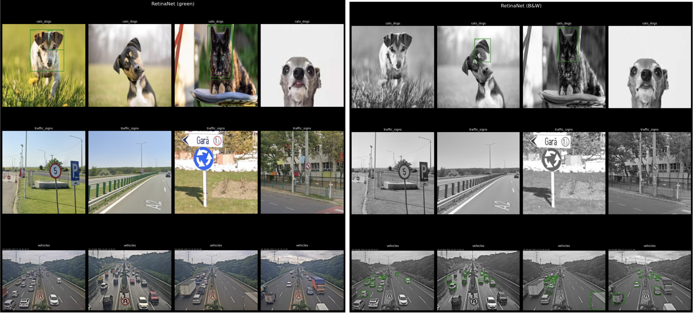
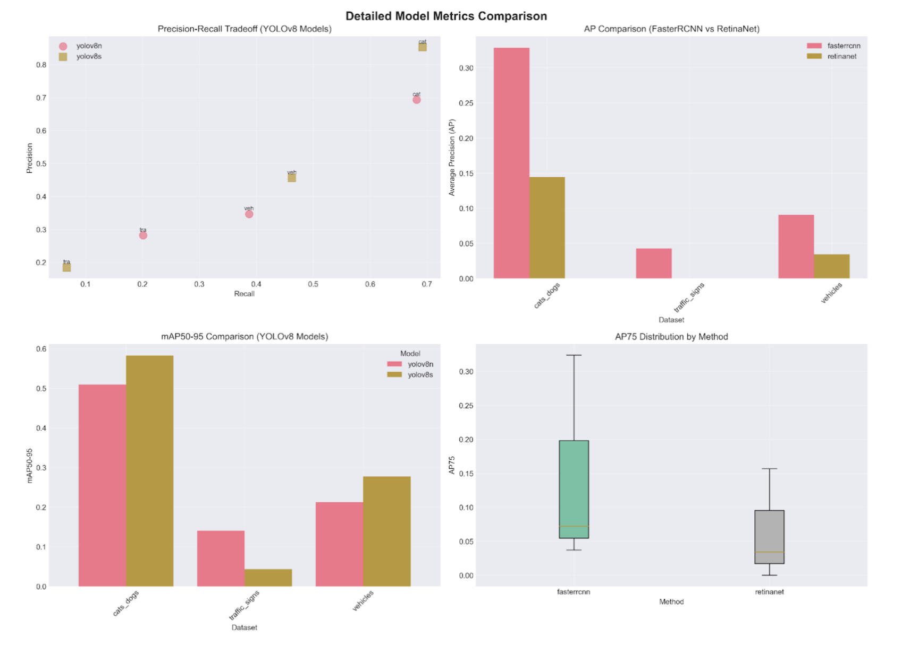
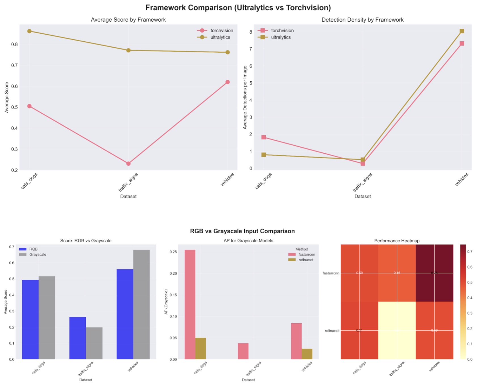
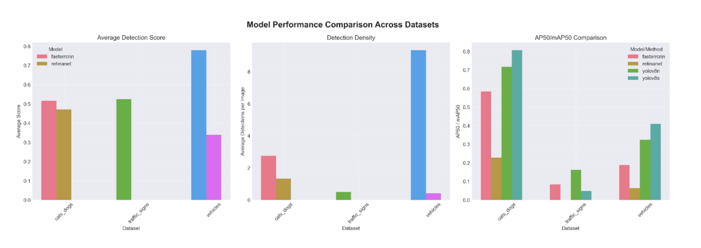

# Porównanie modeli detekcji obiektów: YOLOv8 vs Faster R-CNN vs RetinaNet

## Wprowadzenie

Projekt porównuje trzy popularne modele detekcji obiektów: YOLOv8, Faster R-CNN i RetinaNet.
Każdy model został wytrenowany na trzech różnych zbiorach danych i przetestowany na wspólnym zbiorze walidacyjnym.

## Zbiory danych

Wykorzystano trzy zbiory danych z platformy Roboflow.

| Zbiór danych | Klasy | Liczba obrazów | Rozmiar obiektów |
|---|---|---:|---|
| `cats_dogs` | 2 (cat, dog) | 1046 | Duże |
| `traffic_signs` | 4 (znaki 1–4) | 877 | Małe |
| `vehicles` | 3 (car, truck, bus) | 1200 | Średnie |

Podział danych: train 70%, validation 20%, test 10%.
Formaty danych: YOLO (txt) dla YOLOv8 oraz COCO (JSON) dla Faster R-CNN i RetinaNet.

## Implementacja

### Struktura projektu

```text
WMUM/
├── .venv/
├── data/
│   ├── raw/                          # Dane wejściowe
│   └── processed/                    # Dane do trenowania
│       ├── coco/
│       │   ├── cats_dogs/{train,valid,test}/...
│       │   ├── traffic_signs/{train,valid,test}/...
│       │   └── vehicles/{train,valid,test}/...
│       ├── yolov8/
│       │   ├── cats_dogs/...
│       │   ├── traffic_signs/...
│       │   └── vehicles/...
│       └── _reports/                 # Raporty
├── notebooks/                        # Notebooki krok-po-kroku (pipeline projektu)
│   ├── 01_prepare_data.ipynb
│   ├── 02_train_yolo.ipynb
│   ├── 03_train_torchvision.ipynb
│   ├── 04_eval_models.ipynb
│   ├── yolov8n.pt                    # Bazowe wagi YOLOv8 (checkpoint startowy)
│   └── yolov8s.pt                    # Bazowe wagi YOLOv8 (checkpoint startowy)
├── runs/
│   ├── eval_vis/                     # Lekkie wyniki do porównań (obrazy z bbox + CSV)
│   │   ├── ultralytics/{dataset}__{model}/...__pred.jpg
│   │   ├── torchvision/{dataset}__{method}/...__pred.jpg
│   │   └── quick_eval_all.csv
│   ├── ultralytics/                  # Wyniki treningu YOLO (wagi, wykresy)
│   │   └── summary.csv
│   └── torchvision/                  # Wyniki modeli Torchvision (checkpointy)
│       └── summary.csv
├── src/                              # Kod źródłowy
│   ├── prepare_data.py               # Przygotowanie/naprawa danych
│   ├── train_ultralytics.py          # Trening YOLOv8 (Ultralytics)
│   ├── train_torchvision.py          # Trening Torchvision (Faster R-CNN / RetinaNet)
│   ├── train_torchvision_gray.py     # Eksperyment grayscale
│   └── eval_models.py                # Ewaluacja + wizualizacje predykcji
├── requirements.txt
├── .gitignore
└── README.md
```

### Moduły

- `prepare_data.py`: konwertuje surowe dane z Roboflow do formatów YOLO i COCO oraz waliduje poprawność bounding boxes.
- `train_ultralytics.py`: trenuje YOLOv8n i YOLOv8s.
- `train_torchvision.py`: trenuje Faster R-CNN i RetinaNet.
- `train_torchvision_gray.py`: dodatkowy eksperyment treningu w trybie grayscale (konwersja obrazów do skali szarości przed treningiem).
- `eval_models.py`: ewaluacja wszystkich modeli na wspólnym zbiorze 12 losowych obrazów z folderu validation (seed=0) oraz generacja wizualizacji bbox.

### Hiperparametry treningu

YOLOv8 (Ultralytics):
- Epoki: 20.
- Batch size: 16.
- Image size: 640×640.
- Device: GPU.
- Optimizer: SGD.
- Early stopping: patience=10.

Torchvision (Faster R-CNN / RetinaNet):
- Epoki: 10.
- Batch size: 1.
- Backbone: ResNet-50 (pretrained na ImageNet).
- Learning rate: 0.001.
- Optimizer: SGD.
- Device: CPU.

## Wyniki

### Wyniki treningowe – YOLOv8

| Dataset | Model | Precision | mAP@5 | mAP@50–95 |
|---|---|---:|---:|---:|
| cats_dogs | yolov8n | 0.693 | 0.717 | 0.509 |
| cats_dogs | yolov8s | 0.853 | 0.806 | 0.582 |
| traffic_signs | yolov8n | 0.282 | 0.162 | 0.141 |
| traffic_signs | yolov8s | 0.184 | 0.049 | 0.043 |
| vehicles | yolov8n | 0.346 | 0.324 | 0.212 |
| vehicles | yolov8s | 0.456 | 0.410 | 0.277 |

Obserwacje (YOLOv8): YOLOv8s ma najwyższe wyniki na `cats_dogs` (mAP@50–95 = 0.582), bardzo słabe wyniki na `traffic_signs` oraz umiarkowane na `vehicles`.

### Wyniki treningowe – Torchvision (RGB)

| Dataset | Model | AP@50 | AP@75 | AP@50–95 |
|---|---|---:|---:|---:|
| cats_dogs | fasterrcnn | 0.585 | 0.324 | 0.328 |
| cats_dogs | retinanet | 0.228 | 0.157 | 0.145 |
| traffic_signs | fasterrcnn | 0.084 | 0.037 | 0.043 |
| traffic_signs | retinanet | 0.000 | 0.000 | 0.000 |
| vehicles | fasterrcnn | 0.189 | 0.072 | 0.091 |
| vehicles | retinanet | 0.064 | 0.034 | 0.034 |

Obserwacje (Torchvision): RetinaNet „zawiódł” (AP=0.0 na `traffic_signs`), Faster R-CNN wypada lepiej niż RetinaNet, a oba modele są znacznie słabsze od YOLOv8.

### Ewaluacja na wspólnym zbiorze (12 obrazów)

| Framework | Dataset | Model | Avg Dets | Avg Score |
|---|---|---|---:|---:|
| ultralytics | cats_dogs | yolov8n | 1.17 | 0.717 |
| ultralytics | cats_dogs | yolov8s | 1.00 | 0.734 |
| torchvision | cats_dogs | fasterrcnn | 1.25 | 0.669 |
| torchvision | cats_dogs | retinanet | 0.33 | 0.634 |
| ultralytics | traffic_signs | yolov8n | 1.50 | 0.540 |
| ultralytics | traffic_signs | yolov8s | 0.83 | 0.482 |
| torchvision | traffic_signs | fasterrcnn | 0.17 | 0.707 |
| torchvision | traffic_signs | retinanet | 0.00 | 0.00 |
| ultralytics | vehicles | yolov8n | 3.00 | 0.829 |
| ultralytics | vehicles | yolov8s | 3.00 | 0.858 |
| torchvision | vehicles | fasterrcnn | 3.00 | 0.907 |
| torchvision | vehicles | retinanet | 0.00 | 0.00 |

Kluczowe obserwacje: RetinaNet nie wykrył żadnych obiektów na `traffic_signs` i `vehicles`, YOLOv8s ma najlepsze wyniki na `cats_dogs`, Faster R-CNN jest zaskakująco dobry na `vehicles` (Avg Score 0.907).

### Przykłady wizualizacji

- YOLOv8s przykład: 
  
  
- YOLOv8n przykład:
  
  
- Faster R-CNN RGB vs Grayscale:
  
  
- RetinaNet RGB vs Grayscale:
  

### Wykresy 
Wykresy były generowane poza projektem na podstawie rezultatów zapisanych w plikach CSV.




## Analiza wyników

### YOLOv8

YOLOv8 poradził sobie najlepiej w eksperymencie (warianty v8s i v8n osiągały zazwyczaj zbliżone wyniki).
Może to wynikać z różnic w parametrach treningowych: YOLOv8 trenowano 20 epok, batch=16 na GPU, a modele Torchvision 10 epok, batch=1 na CPU.

### RetinaNet i Faster R-CNN

RetinaNet korzysta z Focal Loss, a w danych było mało klas i mało obiektów na obraz (poza `vehicles`), więc wybór ten mógł nie dać przewagi.
Trening Torchvision ograniczono ze względu na czas, a zwiększanie liczby epok (np. 10→20) nie dało wyraźnej poprawy w obserwacjach autorów.

### Eksperyment grayscale

Trening na obrazach w skali szarości nie poprawił metryk RetinaNet ani Faster R-CNN.
Jako najbardziej prawdopodobną przyczynę wskazano zbyt krótki trening (CPU + batch=1) i zbyt małą liczbę epok, przez co model mógł nie „nadrobić” zmiany wejścia z RGB na grayscale.

## Wnioski

1. YOLOv8s osiąga najlepsze wyniki (mAP@50–95 = 0.582 na `cats_dogs`).
2. RetinaNet praktycznie się nie sprawdził (prawie zero detekcji na większości zbiorów).
3. Faster R-CNN osiąga przyzwoite wyniki mimo ograniczeń (CPU, 10 epok).
4. Małe obiekty (`traffic_signs`) stanowią wyzwanie dla wszystkich modeli.
5. Eksperyment grayscale nie przyniósł poprawy.
6. 10–20 epok to najprawdopodobniej za mało dla Faster R-CNN i RetinaNet w tych warunkach treningowych.

## Źródła danych

- https://universe.roboflow.com/radu-oprea-r4xnm/traffic-signs-detection-europe/dataset/14
- https://universe.roboflow.com/cats-and-dogs-detection/object-detection-cat-and-dogs/dataset/3
- https://universe.roboflow.com/roboflow-100/vehicles-q0x2v/dataset/2

## Bibliografia

1. Muhammad Yaseen, *What is YOLOv8: An In-Depth Exploration of the Internal Features of the Next-Generation Object Detector*.
2. Ross Girshick, Donahue, Darrell, Malik, *Rich feature hierarchies for accurate object detection and semantic segmentation*.
3. Ross Girshick, *Fast R-CNN*.
4. Ultralytics (2023), YOLOv8 Documentation: https://docs.ultralytics.com/models/yolov8/
5. Materiały z wykładów WMUM, UKSW 2025.
6. Hao Zhang, Feng Li, Shilong Liu i in., *DINO: DETR with Improved DeNoising Anchor Boxes for End-to-End Object Detection*.
7. TorchVision Object Detection Finetuning Tutorial: https://docs.pytorch.org/tutorials/intermediate/torchvision_tutorial.html
